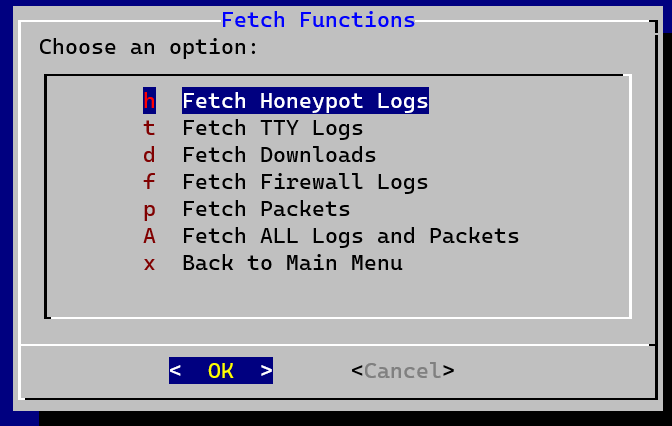

The original dshieldManager.bash was running out of screen real estate (and alphabet shortcuts) rapidly. 
I still like it, but it's just so busy and difficult to look at once the empty space has been consumed.

With this in mind, I've decided to upgrade to an ncurses/dialog menu system.

Here's a brief overview of the menu, which could very well change.

 
***The Main Menu*** 
This includes sub-menus according to the data/log type being managed. 
h   Manage Honeypot Logs 
f   Manage Firewall Logs 
p   Manage Packets 
t   Manage TTY Logs 
d   Manage Downloads 
F   Perform Get/Fetch Functions 
x   Exit 

 
***Manage Honeypot Logs*** 
Short menu differentiating "Daily" operations, and "ALL LOGS" operations. 

 
***Daily Honeypot Logs*** 
f   Fetch Logs from Sensors 
i   Import Daily Logs to sqlite database for analysis 
v   View the Daily Database just created. 
ip  Display the Top 5 Source IPs for the day. 
URL Display the Top 5 URL Requests for the day. 

 
***Date Select*** 
Used when selecting the "Import Daily Logs to sqlite" function to select the date to import. 

 
***Manage ALL Honeypot Logs*** 
Similar to Daily Honeypot Logs menu with the exception of being focused on ALL Honeypot lots in our archive. 
Working with ALL logs, particularly importing, can take several minutes depending on processor speed. 
The remaining functions also mimic daily, with focus on ALL. 

 
***Manage Firewall Logs*** 
Fetch, Import and View the Daily logs, along with Fetch, Import and View ALL Firewall Logs for all time.

 
***Manage Packets*** 
f   Fetch packets from sensor(s) 
e   Extract Packets 
U   Upload and Ingest Packets to Security Onion Server 

 
***Manage TTY Logs*** 
f   Fetch TTY Logs from Sensor(s) 
e   Extract TTY Logs (downloaded in .zip format) 
R   Replay TTY Log 

 
***Manage Downloads*** 
f   Fetch Downloads from Sensor(s) 
e   Extract Downloads (downloaded in .zip format, password protected with "infected") 

 
***Fetch Functions*** 
Repeats each of the data type "fetch" functions into a single menu. 
h   Fetch Honeypot Logs 
t   Fetch TTY Logs 
d   Fetch Downloads 
f   Fetch Firewall Logs 
p   Fetch Packets 
A   Fetch ALL Logs and Packets <-- THIS CAN TAKE A LONG TIME AND A LOT OF BANDWIDTH! 

 
